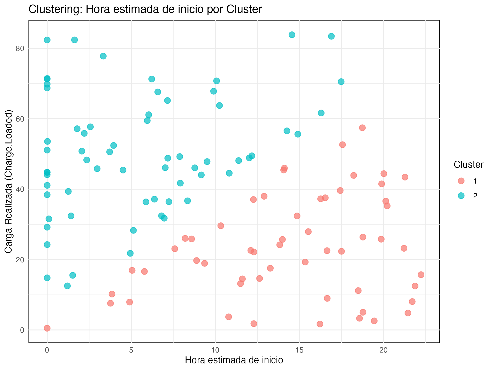
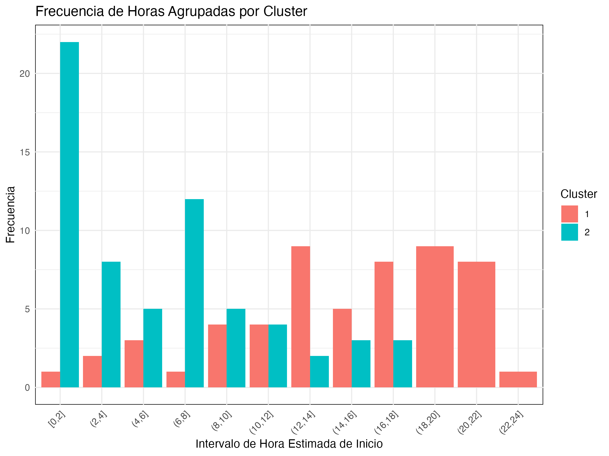

```{r setup, include=FALSE}
knitr::opts_chunk$set(echo = TRUE)
```

En esta actividad final de analítica avanzada, mi objetivo es realizar un ejercicio de **segmentación o clustering** para identificar patrones en los datos de carga de vehículos eléctricos. Para ello, seleccioné variables relevantes, apliqué el algoritmo de clustering, interpreté los resultados y razoné las implicaciones comerciales basándome en los patrones encontrados.

El análisis se enfoca en encontrar momentos clave para mostrar anuncios en función de los patrones de carga detectados. Aunque el dataset incluye un timestamp para la hora de inicio de carga, este dato parece haber sido generado programáticamente, siguiendo un patrón evidente. Por este motivo, he optado por basar el análisis en la hora de finalización de la carga (`Charging.End.Time`), ya que considero que refleja mejor el comportamiento real de los usuarios.

---

## Selección de variables

Para este análisis seleccioné las siguientes variables:

- **`Charge.Loaded` (carga realizada):** Representa la cantidad de energía cargada durante una sesión en kWh. Es crucial para distinguir entre usuarios con cargas grandes y pequeñas.
- **`Charging.End.Time` (hora de finalización):** Hora exacta en la que el vehículo termina de cargarse. Utilicé esta variable porque es más confiable que la hora de inicio generada programáticamente.

Estas variables permiten segmentar a los usuarios en función de su comportamiento de carga, ignorando factores como el tipo de cargador o el rate. Independientemente de estos factores, considero que los usuarios que realizan cargas más largas están planificando trayectos extensos, mientras que las cargas rápidas corresponden a usuarios con necesidades inmediatas.

---

## Metodología

1. **Preprocesamiento de datos:**
   - Filtré los datos para eliminar valores inconsistentes, como NA o cargas negativas.
   - Calculé `Estimated.Start.Time` restando la duración de carga (`Calculated.Duration..hours.`) a la hora de finalización (`Charging.End.Time`). Aunque este cálculo introduce cierta suposición, permite analizar los momentos en que los usuarios probablemente comiencen sus cargas.
   - Validé los datos a través de una condición que compara la energía teórica consumida (`Theoretical.Energy.Consumed`) con la energía real (`Energy.Consumed..kWh.`), filtrando inconsistencias.

2. **Normalización:**
   - Escalé las variables `Charge.Loaded` y `Charging.End.Time` para que tuvieran un rango similar, evitando que una dominara el clustering.

3. **Análisis de correlación:**
   - Generé una matriz de correlación entre las variables del dataset (`Charge.Loaded`, `Estimated.Start.Time`, entre otras). Esto permitió identificar relaciones significativas y eliminar redundancias que podrían sobreponderar los resultados del clustering.

4. **Aplicación del algoritmo:**
   - Utilicé el algoritmo de **K-Means clustering** con 2 clusters. Este número fue suficiente para segmentar usuarios con patrones distintos de carga.

5. **Visualización:**
   - Generé gráficos que muestran los resultados del clustering y las frecuencias de horas agrupadas en intervalos.

---

## Resultados

### Matriz de correlación

La matriz de correlación generada valida que las variables seleccionadas (`Charge.Loaded` y `Estimated.Start.Time`) son lo suficientemente independientes para usarse en el análisis. El heatmap a continuación ilustra visualmente estas relaciones:


### Visualización del clustering

El gráfico a continuación muestra los resultados del clustering aplicado. Los puntos están coloreados según el cluster al que pertenecen. Esto permite visualizar cómo se agrupan los datos en función de la carga realizada y la hora estimada de inicio:



### Frecuencia de horas agrupadas

Este gráfico muestra las frecuencias de las horas estimadas de inicio, agrupadas en intervalos de 2 horas. Es una forma de identificar momentos clave en cada cluster:



### Interpretación de los resultados

1. **Cluster 1 (cargas menores):**
   - Los usuarios con cargas menores suelen comenzar entre **12 PM y 8 PM**, destacándose los intervalos **(12,14] y (18,20]** con 9 registros cada uno.
   - También hay actividad significativa entre **4 PM y 10 PM**, especialmente en los intervalos **(16,18] y (20,22]**.

2. **Cluster 2 (cargas mayores):**
   - Los usuarios con cargas mayores tienden a iniciar sus sesiones principalmente entre **12 AM y 2 AM**, con 22 registros.
   - Existe actividad secundaria entre **6 AM y 8 AM** (12 registros) y en el intervalo **2 AM a 4 AM** (8 registros).

El razonamiento detrás del análisis de estas horas es que la hora de inicio calculada es más representativa para la planificación de anuncios. Este cálculo se basa en la hora de finalización, restando la duración de carga, ya que refleja un momento aproximado en que los usuarios llegan a la estación de carga.

---

## Descripción del script de clustering

El script de clustering utilizado en este análisis puede encontrarse en el siguiente enlace: [Clustering Script](https://github.com/marthinal/ev_ad_strategy/blob/main/scripts/clustering.R). Este script realiza los siguientes pasos principales:

1. **Carga y limpieza de datos:** Se filtran valores inconsistentes y se realizan cálculos derivados como `Charge.Loaded` y `Estimated.Start.Time`.
2. **Validación:** Los datos se filtran para mantener registros consistentes en cuanto a energía consumida y calculada.
3. **Análisis de correlación:** Se calcula la matriz de correlación para evaluar la relación entre las variables seleccionadas.
4. **Normalización:** Las variables seleccionadas se escalan para garantizar que estén en el mismo rango de valores.
5. **Clustering:** Se aplica el algoritmo K-Means con un número predefinido de clusters (2 en este caso).
6. **Visualización:** Se generan gráficos que muestran los resultados del clustering y las frecuencias de horas agrupadas en intervalos.

---

## Conclusión

Este análisis me permitió:

- Identificar patrones claros de carga utilizando técnicas de clustering.
- Comprender la importancia de las horas estimadas de inicio para optimizar decisiones comerciales.
- Segmentar a los usuarios en dos grupos relevantes: uno con cargas menores y otro con cargas mayores.

### Tipos de anuncios sugeridos

1. **Cluster 1 (cargas menores):**
   - Usuarios que realizan cargas rápidas y suelen tener necesidades inmediatas. Sugerencias:
     - **Anuncios de cafeterías y snacks:** Servicios rápidos y accesibles.
     - **Promociones locales:** Descuentos en tiendas cercanas que pueden atraer atención en periodos cortos.

2. **Cluster 2 (cargas mayores):**
   - Usuarios que planifican trayectos largos y tienen sesiones prolongadas de carga. Sugerencias:
     - **Anuncios de hoteles y servicios de descanso:** Relevantes para usuarios que necesitan más tiempo para cargar.
     - **Servicios de mantenimiento automotriz:** Ideal para usuarios que aprovechan la carga para revisiones.